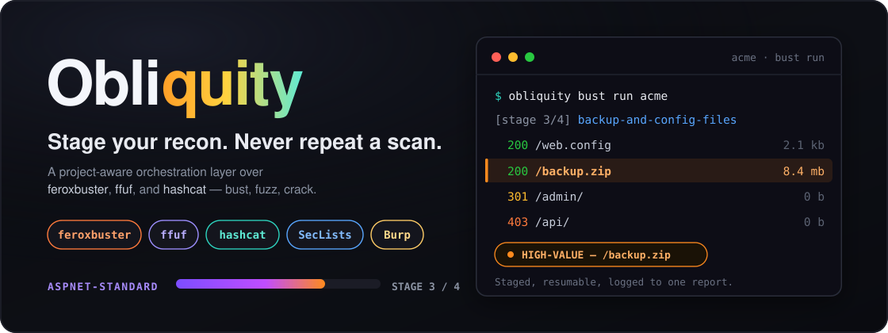

<div align="center">




[](https://www.python.org/)
[](LICENSE)
[](CHANGES.md)
[](tests/)
[](https://github.com/epi052/feroxbuster)
[](https://github.com/ffuf/ffuf)
[](https://hashcat.net/hashcat/)

**A staged orchestration layer over `feroxbuster`, `ffuf`, and `hashcat`** --
project-aware, resumable, and reported in one place instead of three.

[Quickstart](#quickstart) &nbsp;&middot;&nbsp;
[Features](#features) &nbsp;&middot;&nbsp;
[Usage](#usage) &nbsp;&middot;&nbsp;
[Roadmap](#roadmap--future-features) &nbsp;&middot;&nbsp;
[Contributing](#contributing)

</div>

---

<details>
<summary><strong>Terminal banner</strong> (what you see when you run any command)</summary>

```text
      ___.   .__  .__             .__  __
  ____\_ |__ |  | |__| ________ __|__|/  |_ ___.__.
 /  _ \| __ \|  | |  |/ ____/  |  \  \   __<   |  |
(  <_> ) \_\ \  |_|  < <_|  |  |  /  ||  |  \___  |
 \____/|___  /____/__/\__   |____/|__||__|  / ____|
           \/            |__|               \/
```

*(renders in a 7-color gradient in a real terminal)*

</details>

<div align="center">

<!--
  Screenshot placeholder. Drop a terminal capture of `obliquity bust run`
  or the HTML report at docs/images/demo.png and this will pick it up.
-->


<sub><em>Screenshot placeholder -- add <code>docs/images/demo.png</code> (a terminal run or the HTML report) and this shows it.</em></sub>

</div>

---

## Table of contents

- [What is Obliquity?](#what-is-obliquity)
- [Features](#features)
- [Requirements](#requirements)
- [Installation](#installation)
  - [Using a virtual environment](#using-a-virtual-environment)
- [Quickstart](#quickstart)
- [Usage](#usage)
  - [`bust`: content discovery](#bust-content-discovery)
  - [`fuzz`: parameter and API fuzzing](#fuzz-parameter-and-api-fuzzing)
  - [`crack`: hash cracking](#crack-hash-cracking)
  - [Wordlist setup](#wordlist-setup)
  - [Reports](#reports)
  - [Resume & scan history](#resume--scan-history)
  - [Burp proxy example](#burp-proxy-example)
- [Built-in gameplans](#built-in-gameplans)
- [How resume actually works](#how-resume-actually-works)
- [Data location](#data-location)
- [Roadmap / future features](#roadmap--future-features)
- [Contributing](#contributing)
- [License](#license)

---

## What is Obliquity?

Obliquity is a CLI for staged penetration-testing tool orchestration, built
around three pillars, each wrapping one underlying tool:

| Pillar | Tool | Job |
|---|---|---|
| **`bust`** | [`feroxbuster`](https://github.com/epi052/feroxbuster) | Staged directory/file content discovery |
| **`fuzz`** | [`ffuf`](https://github.com/ffuf/ffuf) | Parameter, endpoint, and raw-request fuzzing |
| **`crack`** | [`hashcat`](https://hashcat.net/hashcat/) | Staged password/hash cracking |

It is **not** a replacement for any of those tools -- it's a thin, honest
wrapper that adds the project management layer they don't try to be:

- project + host/job tracking, with per-host metadata (`--tech`, `--server`, `--profile`)
- JSON gameplans: an ordered sequence of stages instead of one flag-heavy command
- **completed-stage skipping** -- rerunning a finished gameplan doesn't redo the work
- **stop-and-warn instead of silently repeating scans**, with a suggested next step
- raw output archiving + JSONL parsing into one shared SQLite database per project
- unified reporting across all three tools: HTML, JSON, CSV, and Markdown
- a small downloadable wordlist catalog, so you're not manually `git clone`-ing SecLists

### The pain it solves

A real engagement rarely means *one* content-discovery scan. For a single
host you end up running feroxbuster over and over: `common.txt`, then
`big.txt`, then `raft-medium`, then `raft-large`, then the same lists again
with `.bak`/`.old`/`.zip`/`.config` extensions, then again recursively into
each interesting directory you just found (`/admin/`, `/backup/`, `/api/`).
That's easily 4-6 wordlist passes per host -- and then you multiply the
whole thing by every host in scope, and again by every promising
subdirectory.

Doing that by hand means babysitting a queue of near-identical commands,
manually remembering which wordlist/extension/depth combination you've
already thrown at which host and which path, and starting over from scratch
whenever a scan gets interrupted or you close the laptop. It's slow, it's
easy to lose your place in, and it's miserable to resume cleanly.

Obliquity turns that into a single declarative gameplan per host. It runs
the passes in order, fingerprints each one so it never repeats a
combination it's already completed, resumes where you left off, and logs
every finding from every host into one project database and one report --
so the busywork disappears and you just read results.

## Features

- **Project-based target management** -- one project, many hosts, each with
  its own server/tech/profile metadata that Obliquity actually uses (see
  [Host/Application Awareness](#bust--content-discovery) below)
- **Resumable by design** -- every stage is fingerprinted on its exact
  parameters (wordlist, extensions, recursion, hash type, attack mode, ...)
  and skipped once completed
- **Smart-ish rerun handling** -- trying to rerun a fully completed
  gameplan stops, tells you what it already found and when, and offers a
  sensible escalation instead of either silently doing nothing or silently
  redoing everything
- **Gameplan escalation ladders** -- `generic-quick` -> `generic-standard`
  -> `generic-deep`, `quick-dictionary` -> `standard`, offered automatically
- **Unified scan history** across all three tools in one readable log
- **Multi-format reporting** -- HTML (with cracked-hash and crack-run
  sections), JSON, CSV, and Markdown, all from the same underlying data
- **Downloadable wordlist catalog** -- no more manually cloning all of
  SecLists just to get `common.txt` and `rockyou.txt`
- **Dry-run mode** everywhere, and Burp-friendly proxy/header passthrough

## Requirements

- Python 3.10+
- `feroxbuster`, `ffuf`, and `hashcat` installed and available on `PATH`
  (`obliquity doctor` checks all three for you)
- SecLists content for the default profiles -- or just let Obliquity
  download the handful of files it actually needs, see
  [Wordlist setup](#wordlist-setup)

macOS (Homebrew):

```bash
brew install feroxbuster ffuf hashcat
```

Kali/Debian-family:

```bash
sudo apt install feroxbuster ffuf hashcat
```

## Installation

From inside this repo:

```bash
python3 -m pip install -e .
```

Or run it without installing at all:

```bash
python3 -m obliquity.cli --help
```

### Using a virtual environment

You'll very likely need one. On recent Python installs -- Homebrew Python
on macOS, and most current Linux distros -- `pip install` directly into the
system Python refuses to run at all, with an `externally-managed-environment`
error. Even where it's allowed, installing project dependencies system-wide
is how unrelated projects end up breaking each other's package versions. A
virtual environment (`venv`) is just a private, disposable copy of Python +
`pip` scoped to this project only, so none of that happens.

```bash
python3 -m venv .venv
source .venv/bin/activate      # macOS/Linux
# .venv\Scripts\activate       # Windows (PowerShell: .venv\Scripts\Activate.ps1)
python3 -m pip install -e .
```

**A venv only needs activating once per terminal session** -- not before
every single command. Once you `source .venv/bin/activate`, your prompt
gets a `(.venv)` prefix and `obliquity`/`python3`/`pip` all resolve inside
it until you close that terminal tab or run `deactivate`. Opening a *new*
terminal tab starts a fresh shell that isn't activated, so you'll need to
run the `source` line again there -- that's a property of terminals, not
something wrong with the venv.

**Making it persistent**, if re-typing `source .venv/bin/activate` in every
new terminal gets old, pick one:

<details>
<summary><strong>Option A -- auto-activate with <code>direnv</code></strong> (recommended if you work in this repo a lot)</summary>

```bash
brew install direnv          # or your package manager
echo 'eval "$(direnv hook zsh)"' >> ~/.zshrc   # or ~/.bashrc for bash
echo "source .venv/bin/activate" > .envrc
direnv allow
```

Now the venv activates automatically the moment you `cd` into this
directory, and deactivates when you leave it. Nothing to remember.

</details>

<details>
<summary><strong>Option B -- install with <code>pipx</code></strong> (recommended if you just want the <code>obliquity</code> command, and don't care about venvs at all)</summary>

```bash
brew install pipx            # or: python3 -m pip install --user pipx
pipx install --editable .
```

`pipx` builds and manages its own isolated venv for you behind the scenes
and puts `obliquity` straight on your `PATH` -- no activation step, ever,
in any terminal.

</details>

<details>
<summary><strong>Option C -- a shell alias</strong> (simplest, one line in your shell rc file)</summary>

```bash
echo "alias obliquity-env='source /path/to/obliquity/.venv/bin/activate'" >> ~/.zshrc
```

Then just type `obliquity-env` in any new terminal before using the tool.

</details>

## Quickstart

```bash
# 1. Create a project
obliquity project create acme

# 2. Add a host, with whatever metadata you already know
obliquity host add acme https://app.acme.com --server iis --tech aspnet

# 3. Preview the plan -- no --gameplan needed, Obliquity recommends one
#    from the host's --tech/--server/--profile (aspnet-standard here)
obliquity bust plan acme

# 4. Run it
obliquity bust run acme --open-report
```

That's the whole loop: project, host, plan, run, report. Everything below
is what's available once you need more control.

## Usage

### `bust`: content discovery

```bash
# Dry-run first to see the exact feroxbuster command that will run
obliquity bust run acme https://app.acme.com --gameplan aspnet-standard --dry-run

# Run it for real
obliquity bust run acme https://app.acme.com --gameplan aspnet-standard

# Resume later -- completed stages are skipped automatically
obliquity bust resume acme https://app.acme.com --gameplan aspnet-standard
```

The host URL is only needed when a project has more than one host -- with
exactly one, every `bust`/`fuzz` `plan`/`run`/`resume` command uses it
automatically:

```bash
obliquity bust run acme --gameplan aspnet-standard
```

**Host/Application Awareness**: `--gameplan` itself is optional. With
`--tech`/`--server`/`--profile` set on the host, Obliquity recommends a
matching built-in gameplan instead of always defaulting to `generic-quick`,
and always shows *why*:

```text
Selected gameplan: aspnet-standard  (recommended: tech=aspnet)
```

An explicit `--gameplan` always wins outright, with no label.

### `fuzz`: parameter and API fuzzing

`bust` finds content; `fuzz` is for when the interesting value belongs
*inside* a request -- a parameter name, a parameter value, or a field in a
raw captured request.

```bash
# List every fuzz gameplan
obliquity gameplans list

# Discover accepted GET parameter names
obliquity fuzz run acme https://app.acme.com --gameplan parameter-names-quick --endpoint /search

# Fuzz values for a known parameter
obliquity fuzz run acme https://app.acme.com --gameplan parameter-values-quick --template '/search?q=FUZZ'

# Fuzz a raw request captured from Burp (FUZZ marker inside the file)
obliquity fuzz run acme https://api.acme.com --gameplan api-request-quick --request ./request.txt

# Coverage across tools -- what's already been tried against this host
obliquity coverage acme
obliquity coverage acme https://api.acme.com
```

### `crack`: hash cracking

hashcat cracks password hashes gathered during an engagement, staged the
same way bust/fuzz gameplans are: a plain dictionary first, then the same
dictionary with rules, then a mask fallback -- each stage runs only if the
previous one didn't recover everything.

```bash
# Add a hash file as a crack job (plays the role a host URL plays for bust/fuzz)
obliquity crack job add acme ./dumped-hashes.txt --hash-type 1000 --name ntlm-dump

# --hash-type is hashcat's -m mode number: 0=MD5, 1000=NTLM, 1800=sha512crypt, ...
# (see `hashcat --help` for the full list)

obliquity crack job list acme

# Preview, dry-run, execute -- job name optional with exactly one job, same as hosts
obliquity crack plan acme --gameplan quick-dictionary
obliquity crack run acme --gameplan quick-dictionary --dry-run
obliquity crack run acme --gameplan standard --open-report

# Resume later
obliquity crack resume acme --gameplan standard
```

> A hashcat exit code of `1` ("exhausted this wordlist/mask, hashes
> remain") is treated as a normal stage completion, not a failure -- that's
> what lets a crackplan fall through to its next stage automatically.

```bash
obliquity doctor
```

`doctor` checks `feroxbuster`, `ffuf`, and `hashcat` (core), plus
`gobuster`/`wfuzz`/`john` (optional, for future alternate-tool support --
see [Roadmap](#roadmap--future-features)).

### Wordlist setup

Obliquity doesn't need the full SecLists repo -- it downloads just the
specific files its built-in gameplans reference, stored under
`~/.obliquity/wordlists/`. A gameplan referencing e.g.
`/usr/share/seclists/...` automatically falls back to the downloaded copy
if that system path doesn't exist, with **no profile edits needed**.

```bash
obliquity wordlists status                            # what's missing
obliquity wordlists setup                              # interactive, asks per wordlist
obliquity wordlists install seclists-common rockyou     # install specific ones
obliquity wordlists install --all-missing               # everything the built-ins need
obliquity wordlists list                                # full catalog + install status
```

`obliquity project create` checks for missing defaults and offers to
download them right there when run interactively.

`rockyou` is the largest catalog entry (~50MB download, ~133MB extracted)
and is only needed for crack gameplans beyond `smoke-test`. For anything
outside this small curated catalog -- CMS-specific lists, Assetnote's
technology-specific collections -- `obliquity wordlists list` prints links
to the full SecLists repo and Assetnote's site; point a custom gameplan
JSON at whatever you download, the same way `--gameplan ./my-plan.json`
already works.

### Reports

HTML is the default/richest format; JSON, CSV, and Markdown are also
available for further processing or sharing:

```bash
obliquity report html acme
obliquity report json acme
obliquity report csv acme --kind cracked-hashes    # or: findings, runs, crack-runs
obliquity report markdown acme
```

Generate and open one automatically after a successful scan:

```bash
obliquity bust run acme --gameplan generic-quick --open-report
```

### Resume & scan history

```bash
obliquity history acme                     # unified log across bust/fuzz/crack
obliquity history acme --tool hashcat
obliquity history acme --status failed --limit 20
```

One readable line per run: timestamp, tool, status, target, gameplan/stage,
finding count, duration. (`obliquity runs` still exists as the lower-level
bust/fuzz-only view.)

### Burp proxy example

```bash
obliquity bust run acme https://app.acme.com \
  --gameplan generic-quick \
  --proxy http://127.0.0.1:8080 \
  --header 'Cookie: session=replace-me'
```

## Built-in gameplans

<table>
<tr><th>Bust (feroxbuster)</th><th>Fuzz (ffuf)</th><th>Crack (hashcat)</th></tr>
<tr valign="top">
<td>

- `generic-quick`
- `generic-standard`
- `generic-deep` *(raft-medium + recursive raft-large -- slow, run after `generic-standard` comes up empty)*
- `aspnet-standard`
- `php-standard`
- `api-quick`
- `smoke-test`

</td>
<td>

- `parameter-names-quick`
- `parameter-values-quick`
- `api-request-quick`

</td>
<td>

- `quick-dictionary` *(single rockyou pass)*
- `standard` *(rockyou, +best66 rules, +policy mask)*
- `smoke-test` *(bundled wordlist, no SecLists needed)*

</td>
</tr>
</table>

Use a custom gameplan path instead of a built-in name, same syntax
everywhere:

```bash
obliquity bust run acme https://app.acme.com --gameplan ./examples/custom-gameplan.json
```

## How resume actually works

Each bust stage is fingerprinted on: target URL, gameplan name, stage name,
wordlist, extensions, recursion setting, depth, status codes, extra args.
Crack stages the same way, keyed on hash file + hash type instead of a URL,
plus attack mode/wordlist/rules/mask. A stage that completed successfully
before is skipped unless `--force` is used.

```bash
obliquity bust run acme https://app.acme.com --gameplan aspnet-standard --force
obliquity crack run acme --gameplan standard --force
```

`bust resume`/`crack resume` always skip completed stages silently --
that's their whole job. A plain `bust run`/`crack run` is different: run it
interactively against a target whose gameplan already fully completed, and
Obliquity stops before doing anything, tells you when it last finished and
what it found, and offers the next step up a small escalation ladder
(`generic-quick` -> `generic-standard` -> `generic-deep`,
`quick-dictionary` -> `standard`) -- accept with `y`. Decline that (or
there's no escalation defined yet) and it falls back to an explicit "rerun
anyway?" confirmation. This only triggers in a real interactive terminal;
scripts and `--force`/`--dry-run` runs are unaffected.

> **Being upfront about a real limitation**: this is *stage-level* resume,
> not *mid-scan* resume. `bust`'s feroxbuster runs with `--no-state`, so an
> interrupted stage restarts its wordlist from the beginning rather than
> continuing where it left off (findings already found aren't lost, but
> requests do get resent). `crack`'s hashcat has real mid-run checkpoint
> capability that Obliquity doesn't use yet either -- see the roadmap.

## Data location

```text
~/.obliquity/
```

Override with:

```bash
export OBLIQUITY_HOME=/path/to/workdir
```

<details>
<summary><strong>Textual UI demo</strong> (fake-data terminal UI playground -- doesn't run tools or touch the real database)</summary>

```bash
python -m pip install -r requirements-tui-demo.txt
python -m obliquity.tui_demo

# Minimal terminal-style experiment
python -m obliquity.tui_terminal_demo

# Posting-inspired keyboard UI experiment
python -m obliquity.tui_posting_demo
```

Arrow keys, Enter, Tab, Space, Escape, and letter shortcuts navigate
workflow screens, settings, review pages, a live dashboard, tables,
sparklines, and a simulated terminal stream -- all fake data, purely a UI
exploration for a possible future dashboard.

</details>

## Roadmap / future features

Obliquity intentionally keeps the current design simple and honest about
what it doesn't do yet. Roughly in the order they'd get built:

- **hashcat mid-run resume** -- pass `--restore` on `crack resume` when a
  checkpoint already exists, instead of silently redoing the whole stage
- **Crack hybrid/combinator attack modes** -- hashcat's `-a 1`
  (combinator: glue two wordlists together) and `-a 6`/`-a 7` (hybrid:
  wordlist + mask, e.g. `Summer` + `?d?d?d?d`) aren't wired up yet, only
  plain dictionary and mask attacks
- **Extension Intelligence** -- avoid double-appending extensions to
  wordlist entries that already have one baked in
- **Host/Application Awareness composition** -- combine tech + intensity +
  auth-required into a generated stage list, instead of picking one static
  built-in gameplan file
- **Recursive auto-follow-up discovery** -- automatically queue deeper
  scans against interesting discovered paths (`/admin`, `/backup`, `/api`)
- **Project export/import** -- move a project, with its full scan history,
  to a different machine
- **Wordlist compiler/deduper** (`obliquity wordlists build`) -- generate
  deduplicated staged lists (`quick`, `standard-delta`, `large-delta`)
- **Alternate-tool backends** -- `gobuster` as an alternative to
  feroxbuster, `wfuzz` as an alternative to ffuf, `john` as an alternative
  to hashcat, selectable per run (defaulting to the current trio) --
  deliberately deferred until bust/fuzz/crack themselves are solid
- **Burp Suite integration** -- a Burp extension bridging to a local
  Obliquity API, so findings and requests can move in both directions

The full prioritized breakdown, including what's already built vs. what's
genuinely just an idea, lives in [`CHANGES.md`](CHANGES.md).

## Contributing

This is an actively developed MVP, not yet accepting external
contributions in a structured way -- issues and ideas are still welcome.
`pytest` (66 tests as of this writing) covers the core adapters, resume
logic, and CLI wiring; run it with:

```bash
python3 -m pip install -e . pytest
pytest
```

## License

[MIT](LICENSE)
